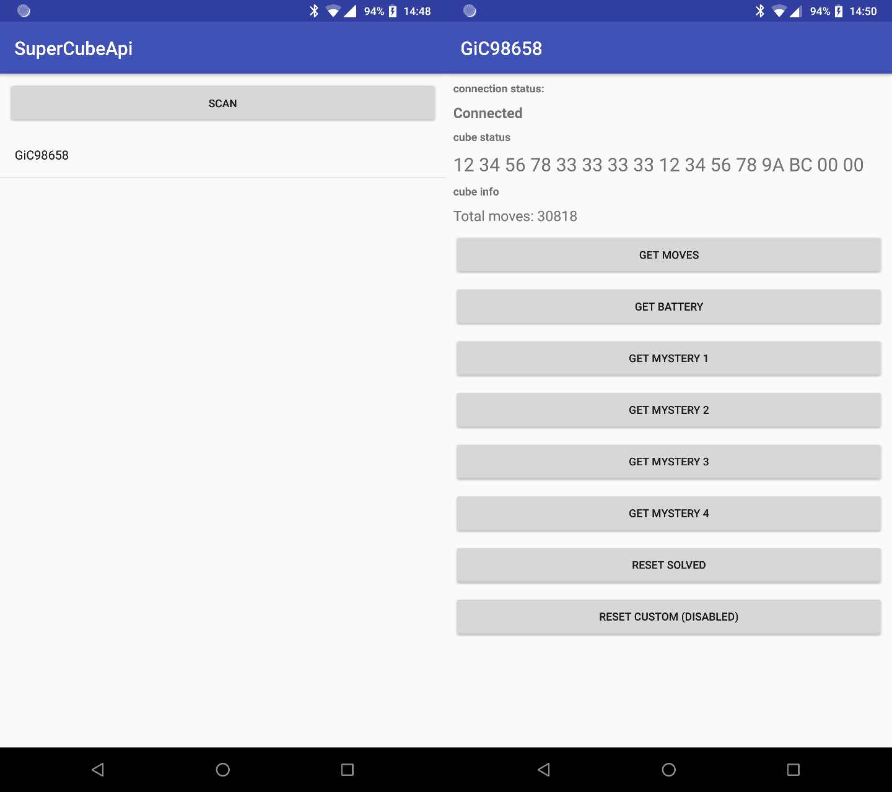

# Super Cube api
Android api for Xiaomi GiiKER Super Cube i3

## Features
- Get total moves and battery
- Reset cube state to solved or custom state
- Get notified when cube state changes

## Usage
Create a new SuperCube with the cube's name and mac address. Add a SuperCubeListener to receive
updates from the cube. Call connect(Context) to connect to the cube and disconnect() to
disconnect from the cube.

## Screenshot

## TODO
- Improve cube state representation
- Timed move counting and reporting

## License
[Apache License 2.0](LICENSE)